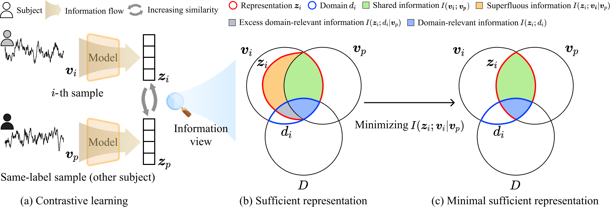

# Multi-scale minimal sufficient representation learning for domain generalization in sleep staging

## Motivation

Comparison between (a) sufficient representation and (b) minimal sufficient representation. In conventional contrastive learning, $\boldsymbol{z}_i$ denotes the normalized feature of the $i$-th sample $\boldsymbol{v}_i$, while $\boldsymbol{z}_p$ represents the feature of a positive sample $\boldsymbol{v}_p$ that shares the same label as $\boldsymbol{v}_i$. The domain factor $D$ denotes the set of attributes that contribute to the domain gap. (a) Sufficient Representation Learning: This approach seeks to maximize the shared information between feature and positive samples $I(\boldsymbol{z}_i ; \boldsymbol{v}_p)$, while simultaneously introducing the superfluous information $I(\boldsymbol{z}_i; \boldsymbol{v}_i | \boldsymbol{v}_p)$, which corresponds to the information present in $\boldsymbol{v}_i$ but absent in $\boldsymbol{v}_p$. Among these, \textit{excess domain-relevant information} $I(\boldsymbol{z}_i ; d_i | \boldsymbol{v}_p)$ caused by domain attributes hinders the learning of domain-invariant features, where $d_i$ refers to the domain label of $\boldsymbol{v}_i$. (b) Minimal Sufficient Representation Learning: This approach aims to reduce the superfluous information $I(\boldsymbol{z}_i; \boldsymbol{v}_i | \boldsymbol{v}_p)$, thereby diminishing the excess domain-relevant information and enabling the learning of more domain-invariant features.
