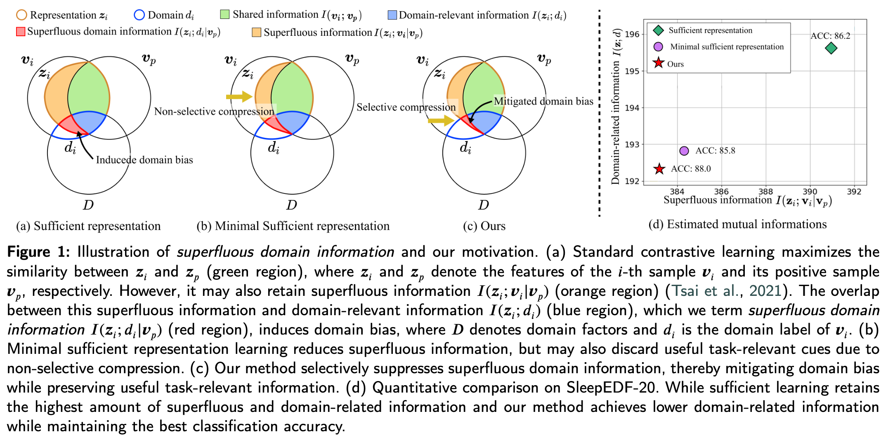
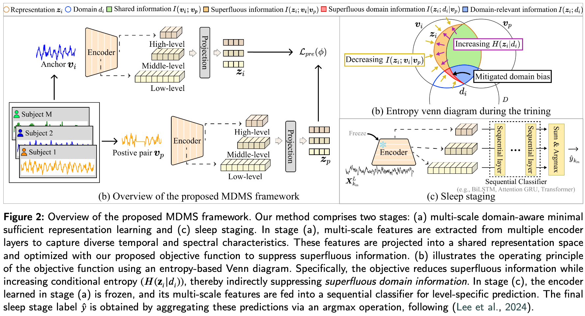

# MEASURE: Multi-Scale Representation Learning for Cross-Subject Sleep Staging

## Motivation

Illustration of \emph{superfluous domain information} and our motivation.
(a) Standard contrastive learning maximizes the similarity between $\boldsymbol{z}_i$ and $\boldsymbol{z}_p$ (green region), where $\boldsymbol{z}_i$ and $\boldsymbol{z}_p$ denote the features of the $i$-th sample $\boldsymbol{v}_i$ and its positive sample $\boldsymbol{v}_p$, respectively. However, it may also retain superfluous information $I(\boldsymbol{z}_i; \boldsymbol{v}_i | \boldsymbol{v}_p)$ (orange region)~\citep{tsai2021self}. The overlap between this superfluous information and domain-relevant information $I(\boldsymbol{z}_i; d_i)$ (blue region), which we term \emph{superfluous domain information} $I(\boldsymbol{z}_i; d_i | \boldsymbol{v}_p)$ (red region), induces domain bias, where $D$ denotes domain factors and $d_i$ is the domain label of $\boldsymbol{v}_i$. (b) Minimal sufficient representation learning reduces superfluous information, but may also discard useful task-relevant cues due to non-selective compression. (c) Our method selectively suppresses superfluous domain information, thereby mitigating domain bias while preserving useful task-relevant information. (d) Quantitative comparison on SleepEDF-20. While sufficient learning retains the highest amount of superfluous and domain-related information and our method achieves lower domain-related information while maintaining the best classification accuracy.

## Overall framework
Overall framework



## Environment Setup
* Python 3.9
* Cuda 12.1
* Pytorch 2.31
* Required libraries are listed in requirements.txt.

```bash
pip install -r requirements.txt
```

## Data Preprosessing
Download the [SleepEDF20](https://www.physionet.org/content/sleep-edfx/1.0.0/), and [MASS3](https://borealisdata.ca/dataset.xhtml?persistentId=doi:10.5683/SP3/9MYUCS) and put them the data dir.

Convert the data to .npz format.
```bash
python Preprocessing.py
```
## Run
Our model consist of pretrain and fintuing part.
### Pretrain
First, model's feature extractor learn the domain-invarint feature via multi-scale minimal sufficient learning.
```bash
python Pretrain.py
```

### Pretrain
Second, To demonstrate the performance of the feature extractor, we train a transformer-based classifier while keeping the parameters of the feature extractor fixed. The transformer-based classifier follows the model proposed in prior work [SleePyCo](https://www.sciencedirect.com/science/article/pii/S0957417423030531) for sleep scoring.

```bash
python FineTuning.py
```

## Acknowledgement
The code is inspired by prior awesome works:

[SleePyCo: Automatic sleep scoring with feature pyramid and contrastive learning
](https://www.sciencedirect.com/science/article/pii/S0957417423030531) (Expert Systems with Applications 2024)

[MVEB: Self-Supervised Learning With Multi-View Entropy Bottleneck
](https://ieeexplore.ieee.org/document/10477543) (Transactions on Pattern Analysis and Machine Intelligence 2024)


